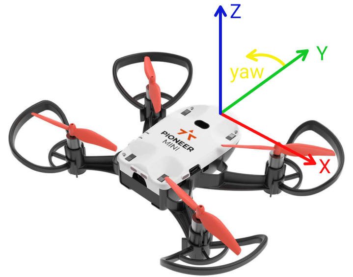

# Блок 3. Полёт по квадрату. (Заметки)

## Системы координат
Система координат дрона изображена ниже на картинке (`X` -- вправо, `Y` -- вперёд, `Z` -- вверх, `yaw` -- против часовой стрелки). При полёте по оптическому потоку связанная с полом система координат фиксируется в момент взлёта, то есть начало координат -- место взлёта, а оси направлены так, как у дрона во время старта.



## Команды полёта в точку
```python
go_to_local_point(x, y, z, yaw)  # В системе отчёта, связанной с местом взлёта
go_to_local_point_body_fixed(x, y, z, yaw)  # В системе отсчёта дрона (относительно его текущего положения)
# x, y, z -- в метрах
# yaw -- в радианах
```

## Ожидание прилёта в точку
```python
drone.point_reached()
# false, если ещё не долетел
# true, если долетел (true возвращается один раз на точку)
```
Пример ожидания прилёта в точку:
```python
drone.go_to_local_point(x, y, z, yaw)
while not drone.point_reached():
    pass
```
